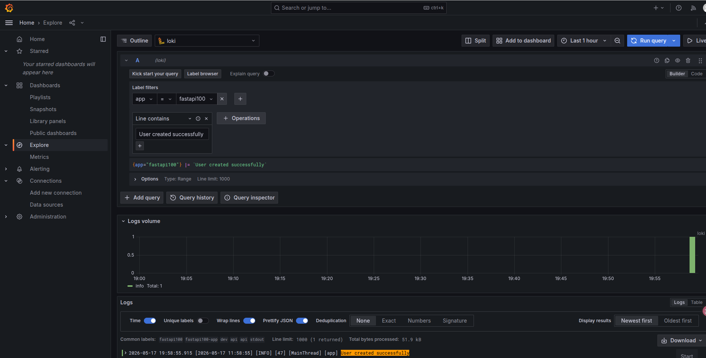

# 项目级别的logging, 通过ymal配置.

## YAML 配置（生产项目常用）

- 控制台 + 文件双输出
- 按日期切割日志
- 区分 INFO / ERROR 日志
- 支持 UTF-8
- 支持 Flask / FastAPI / Celery / 普通 Python 项目
- 支持不同环境（dev/prod）
- 使用 logging.config.dictConfig
- 兼容 Docker / Linux 部署
- 避免重复日志（非常关键）
- 结构清晰，可扩展 ELK / Loki / Sentry

## 目录结构

```
project/
├── app/
│   ├── main.py
│   ├── logging_config.py
│   └── config/
│       └── logging.yaml
├── logs/
│   ├── app.log
│   └── error.log
└── requirements.txt
```

## logging.yaml 
```sh
version: 1

disable_existing_loggers: false

formatters:

  standard:
    format: >-
      [%(asctime)s]
      [%(levelname)s]
      [%(process)d]
      [%(threadName)s]
      [%(name)s]
      %(message)s    
    
    datefmt: "%Y-%m-%d %H:%M:%S"

  simple:
    format: "[%(levelname)s] %(message)s"

handlers:

  console:
    class: logging.StreamHandler
    level: DEBUG
    formatter: standard
    stream: ext://sys.stdout

  info_file:
    class: logging.handlers.TimedRotatingFileHandler
    level: INFO
    formatter: standard

    filename: logs/info.log

    when: midnight
    interval: 1
    backupCount: 30

    encoding: utf-8
    delay: true

  error_file:
    class: logging.handlers.TimedRotatingFileHandler
    level: ERROR
    formatter: standard

    filename: logs/error.log

    when: midnight
    interval: 1
    backupCount: 90

    encoding: utf-8
    delay: true

loggers:

  app:
    level: DEBUG
    handlers:
      - console
      - info_file
      - error_file

    propagate: false

root:
  level: INFO
  handlers:
    - console
```

## logging_config.py
```py
from pathlib import Path
import logging.config
import yaml

BASE_DIR = Path(__file__).resolve().parent
PROJECT_ROOT = BASE_DIR
LOGGING_YAML = BASE_DIR / "config" / "logging.yaml"


def setup_logging() -> None:
    log_dir = PROJECT_ROOT / "logs"
    log_dir.mkdir(parents=True, exist_ok=True)

    with open(LOGGING_YAML, "r", encoding="utf-8") as f:
        config = yaml.safe_load(f)

    # Normalize file handler paths to absolute paths
    for handler in config.get("handlers", {}).values():
        filename = handler.get("filename")
        if filename:
            handler["filename"] = str((PROJECT_ROOT / filename).resolve())

    logging.config.dictConfig(config)
```

## main.py
```py
import logging

from app.logging_config import setup_logging


setup_logging()

logger = logging.getLogger("app")


def main():

    logger.debug("debug message")

    logger.info("info message")

    logger.warning("warning message")

    logger.error("error message")

    logger.exception("exception message")


if __name__ == "__main__":
    main()
```

## 值得关注的点 

**logging.ymal 中的 logger 中的 app 定义的 handlers**
**TimedRotatingFileHandler, 不是多进程安全的**
**SafeTimedRotatingFileHandler 安全版本**
```py
# app/core/logging_handlers.py

import os
import fcntl
from logging.handlers import TimedRotatingFileHandler


class SafeTimedRotatingFileHandler(TimedRotatingFileHandler):
    """
    Linux 多进程安全版 TimedRotatingFileHandler
    适合 gunicorn / uvicorn workers / celery 多进程写同一个日志文件
    yaml文件中 TimedRotatingFileHandler 替换 SafeTimedRotatingFileHandler
    """

    def __init__(self, filename, *args, **kwargs):
        super().__init__(filename, *args, **kwargs)

        self.lock_file = f"{filename}.lock"
        os.makedirs(os.path.dirname(filename), exist_ok=True)

    def emit(self, record):
        with open(self.lock_file, "w") as lock_fp:
            try:
                fcntl.flock(lock_fp.fileno(), fcntl.LOCK_EX)

                # 关键：加锁后再判断是否需要切割
                if self.shouldRollover(record):
                    self.doRollover()

                # 关键：真正写日志
                super(TimedRotatingFileHandler, self).emit(record)

            finally:
                fcntl.flock(lock_fp.fileno(), fcntl.LOCK_UN) 
```

**直接使用现成库**
```py
# pip install concurrent-log-handler
# yaml文件中 TimedRotatingFileHandler 替换 oncurrent_log_handler.ConcurrentTimedRotatingFileHandler
```

## 思考
**分布式日志实现**

**通过docker部署, 可以实现日志统一收集.**
```sh
Python logging → stdout
Promtail → Loki
Grafana 查询
```
